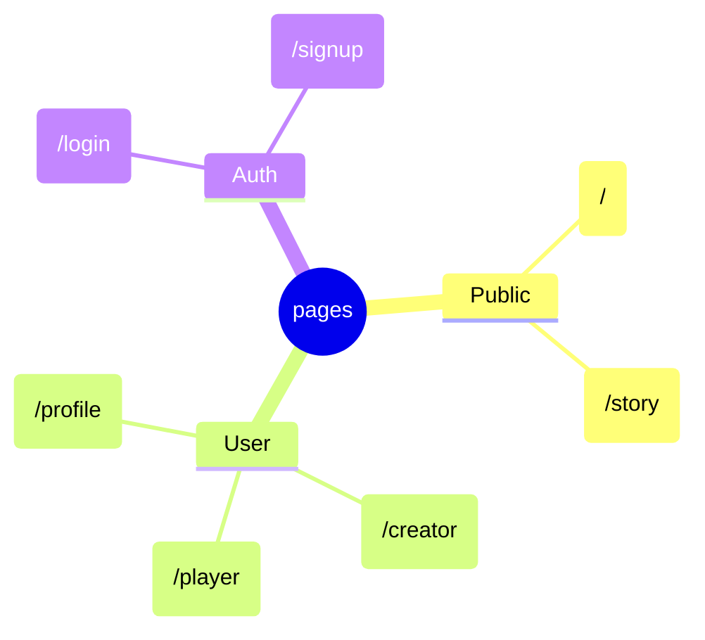

# Readme

## Installation
Clone repo and npm install

### Libraries
* React Router
    * Made by Remix which also a UI library that makes things faster

### Documentation

[React Router Guide](https://blog.webdevsimplified.com/2022-07/react-router/)

## Pages

## React, Firebase and Authentication
Firebase needs to be iniated before sharing the login state.

### Routes
Routed are located at src > app.js

## Components 

StoryBoard - used to display story from db

## Styling

* Can add themes from DaisyUI by modifying the tailwinds.config.js themes array and the html data-theme in index.html
https://daisyui.com/docs/themes/

#### Todos
* Decide on default export (e.g sign out) or namespaced export (most things)